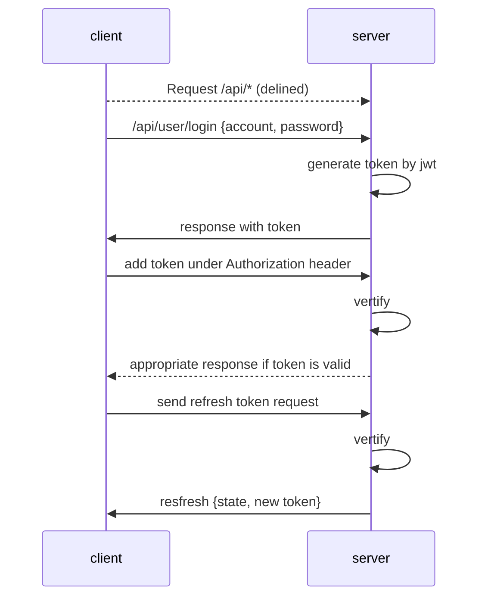
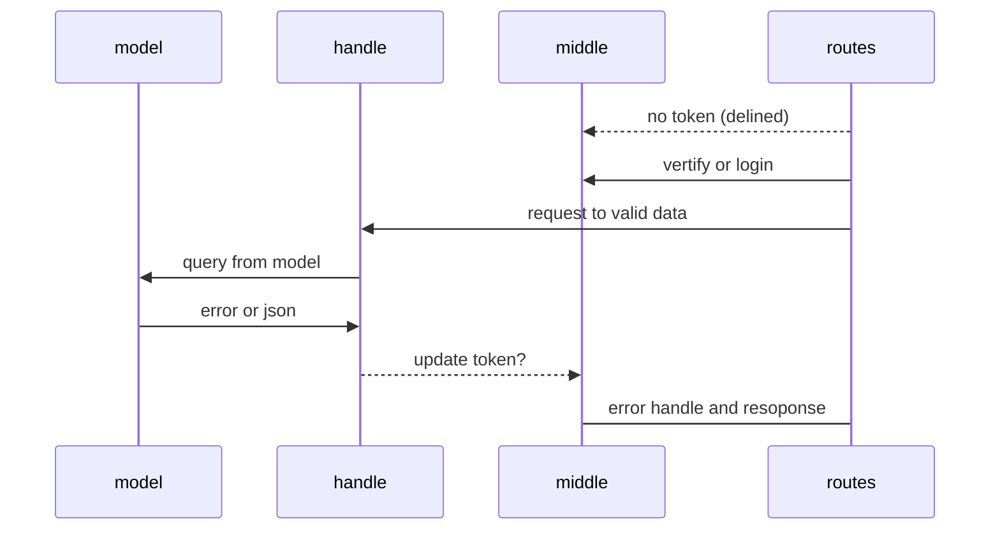

# Backend designing document and procedure

--------------------------------------

version: 0.0.1

## Base set up

--------------------------------------

**token design**

**user permission**

- admin
- user
- visitor

**Structure design**

## user

--------------------------------------

