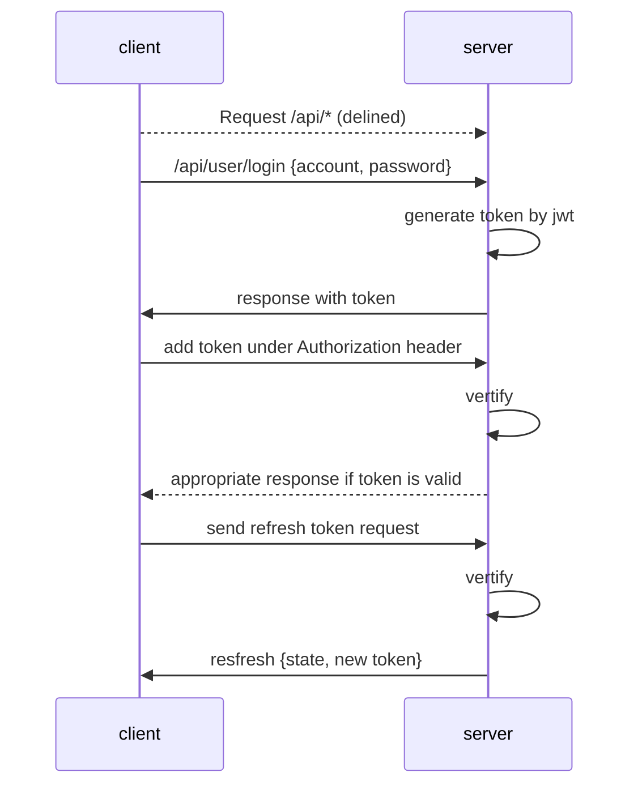
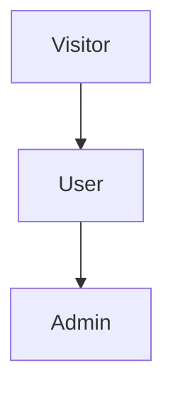
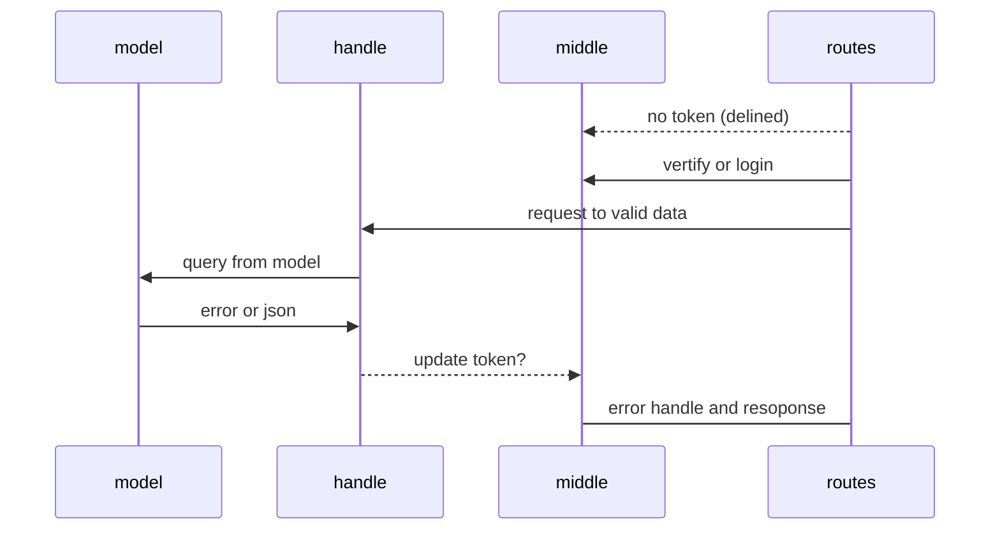
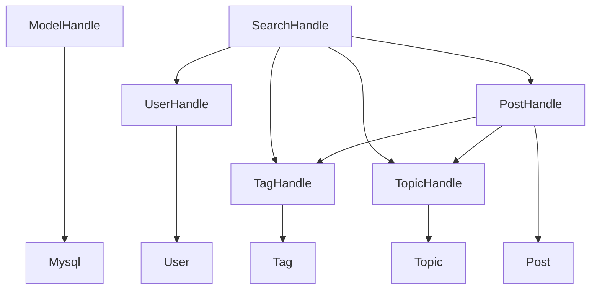
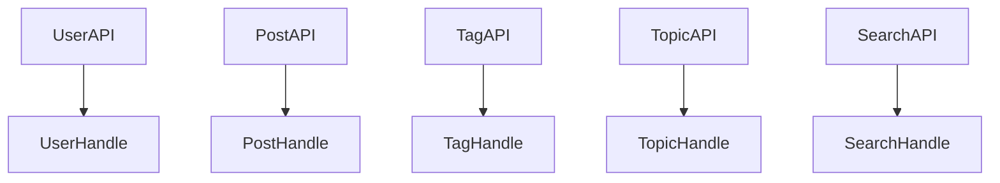

# Backend designing document and procedure

--------------------------------------

version: 0.0.1

## Base set up

--------------------------------------

**token design**
 
To avoid anonymity visit on a heavy api, such as two table select by union or join and update something. would be quite dangerous.
An identity of valid request is important. How to make sure a request is a safe request? token might be a good option. 

| Data     | Datatype |     Usage     |
|----------|:--------:|:-------------:|
| id       |  number  |    User Id    |
| auth     |  string  |  permission   |
| default  |  string  | iat, balabala |
| addition |  string  |    random     |

**user permission**

|          | Admin | User | Visitor |
|:---------|:-----:|:----:|:-------:|
| /admin/* |   X   |      |         |
| /api/*   |   X   |  X   |    X    |
| /*       |   X   |  X   |    X    |    

- admin -> /api*, /admin*
- user -> /api*
- visitor -> /* exclude /admin* and /api/*

3 level design would be good enough to.

**Structure design**

## User

--------------------------------------

### Analyze

In user api should have register, login, update, abort feature.

The user part have to focus on the user database.

**API design**

|        | API                   | Introduction                |
|:------:|-----------------------|-----------------------------|
|  Get   | /api/user             | Get the all the user        |
|  Post  | /api/user             | Create a user               |
|  Put   | /api/user             | Update the user (consider?) |
| Delete | /api/user             | Delete a user (consider?)   |
|        |                       |                             |
|  Get   | /api/user/:id         | Get a user with id          |
|  Post  | /api/user/login       | Login                       |
|  Put   | /api/user/avatar      | Update user avatar          |
|  Put   | /api/user/email       | Update user email           |
|  Put   | /api/user/password    | Update user password        |
| Delete | /api/user/abort/:id   | Abort user                  |
|  Get   | /api/user/restore/:id | Restore user                | 

User password could have no length limit. - md 5 could compress to 32.

## Topic

--------------------------------------

### Analyze

In topic api should have search, create, update, (remove? ) feature.

The topic part should focus on the topic database.

|      | API                        | Introduction                 |
|:----:|----------------------------|------------------------------|
| Get  | /api/topic                 | Get all the topic            |
| Post | /api/topic                 | Create a topic               |
| Put  | /api/topic                 | Update the topic             |
|      |                            |                              |
| Get  | /api/topic/:topic          | Get a topic by id            |
| Put  | /api/topic/image/:id       | Update the topic image       |
| Put  | /api/topic/description/:id | Update the topic description |

## Tag

--------------------------------------

In tag api should have search, create (should integrate into post), update feature.

The tag part should focus on the tag database.

|     | API      | Introduction     |
|:---:|----------|------------------|
| Get | /api/tag | Get all the tags |
| Put | /api/tag | Update the tag   |

## Thumb

--------------------------------------

In thumb api should have search (use thumb?), create (should integrate into post) feature.

Should not remove and update.

## Comment

--------------------------------------

## Home

--------------------------------------

**design**

/shader ->

## Editor

--------------------------------------

**design**

/shader/:id -> to enter into the post

