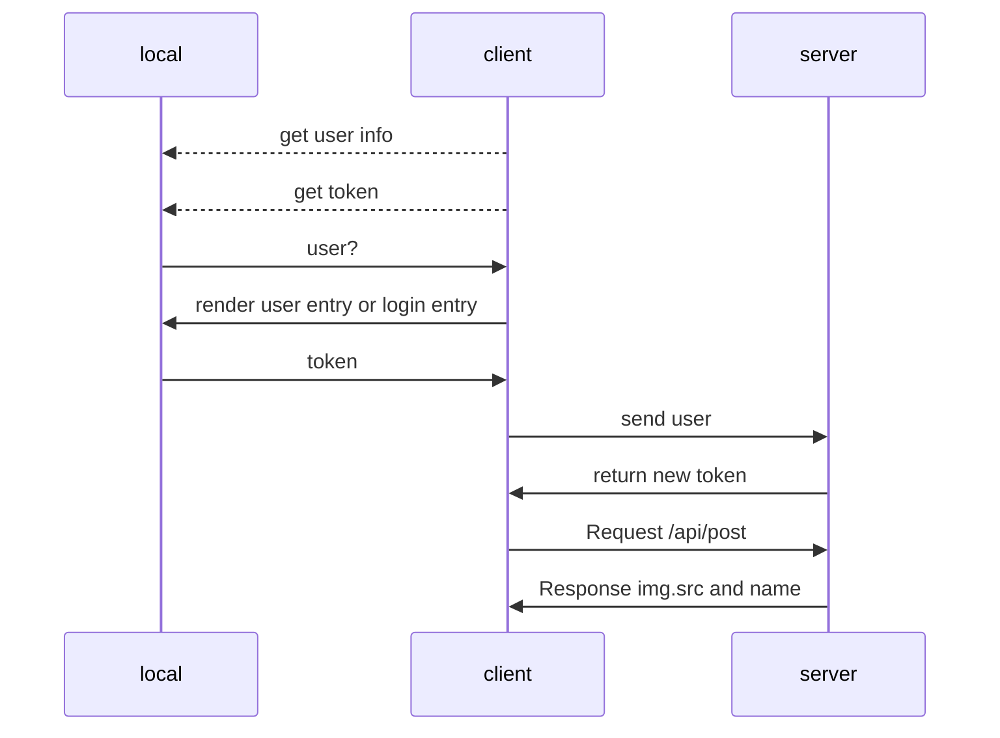
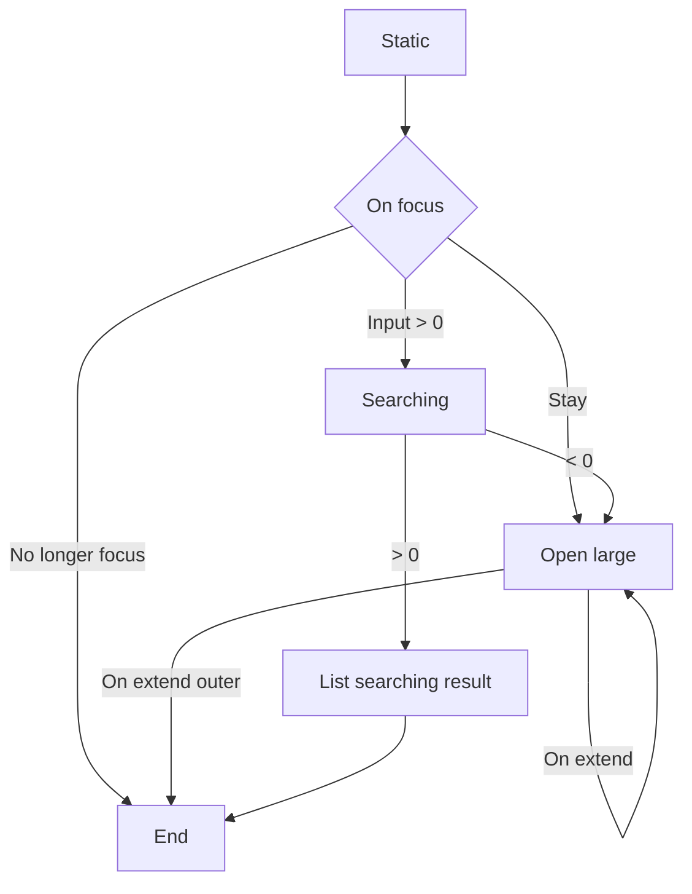
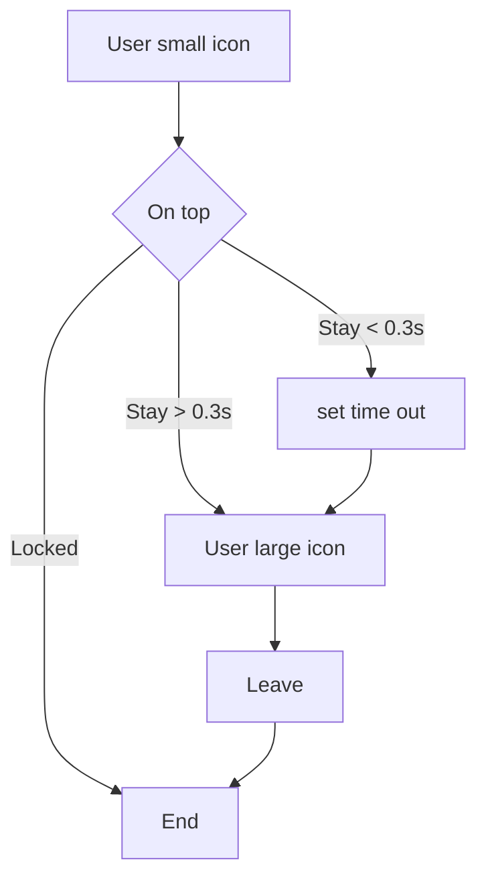

# Page designing document and procedure

--------------------------------------

version: 2.0.1

**language Specification**

| Module  | Specification |
|:-------:|:-------------:|
| nodeJS  |   commonJS    |
| browser | ES 6 Standard |  

https://mermaid-js.github.io/mermaid/

## Login page

--------------------------------------

### Feature

Register and login feature.

Structure design: Background, Navigation Bar, Main Panel

|                |    CSS    |   Naming   | Interop | Mobeile | Desktop |
|----------------|:---------:|:----------:|:-------:|:-------:|:-------:|
| Background     |  inline   | sl-bground |  None   | Disable | Enable  |
| Navigation bar |  nav.css  | sl-navbar  |  None   | Disable | Enable  |
| Main Panel     | panel.css |  sl-panel  |  True   | Enable  | Enable  |

### Analyze

If user already registered, this page should not be load.

| Feature      |                    Request                    |  Response   |
|:-------------|:---------------------------------------------:|:-----------:|
| Page Loading |              GET api/img/random               | RETURN blob |
| Register     | POST {Account: string16, password: string32 } | RETURN JSON |
| Login        | POST {Account: string16, password: string32 } | RETURN JSON |

## Home Page

--------------------------------------

### Feature

In home page we should have three key features:

- search
- user
- preview

Structure design: Navigation, Layout

Navigation: search, filter and user control.

|             |         CSS          |  Naming   | Interop | Mobeile | Desktop |
|-------------|:--------------------:|:---------:|:-------:|:-------:|:-------:|
| Navigation  | nav.css, feature.css |  sl-nav   |  True   | Enable  | Enable  |
| Main Layout |      layout.css      | sl-layout |  True   | Enable  | Enable  |

### Analyze

This page should contain 50% functions of the application, including search, user, info.

Navigation Bar:

Elements under navigation bar has two stage:
- normal -> mini icon.
- large -> panel and large icon.

Left Entry:

|                       |     CSS     |  Naming   | Interop | Mobeile | Desktop |
|-----------------------|:-----------:|:---------:|:-------:|:-------:|:-------:|
| Home Entry            | feature.css | sl-navbar |  True   | Disable | Enable  |
| Login Entry -> shared | feature.css | sl-navbar |  True   | Enable  | Disable |

Right Entry:

|                       |     CSS     |  Naming   | Interop | Mobeile | Desktop |
|-----------------------|:-----------:|:---------:|:-------:|:-------:|:-------:|
| Login Entry -> shared | feature.css | sl-navbar |  True   | Enable  | Disable |
| Message Entry         | feature.css | sl-navbar |  True   | Disable | Enable  |
| History Entry         | feature.css | sl-navbar |  True   | Disable | Enable  |
| Upload Entry          | feature.css | sl-navbar |  True   | Disable | Enable  |

Main Layout:

|           |    CSS     |    Naming    | Interop | Mobeile | Desktop |
|-----------|:----------:|:------------:|:-------:|:-------:|:-------:|
| Recommend | layout.css | sl-recommend |  True   | Enable  | Enable  |
| Holder    | layout.css |  sl-holder   |  True   | Enable  | Enable  |

Layout should get the data from database under **ranking**.

| Feature      |         Request          |   Response   |
|:-------------|:------------------------:|:------------:|
| Page Loading |      GET /api/post       | RETURN JSON  |
|              |   GET /api/user/vertify  | RETURN token |
| Search       |    GET /api/post/tag     | RETURN JSON  |

Search panel implement:

User avatar icon implement:

## Editor Page

--------------------------------------

