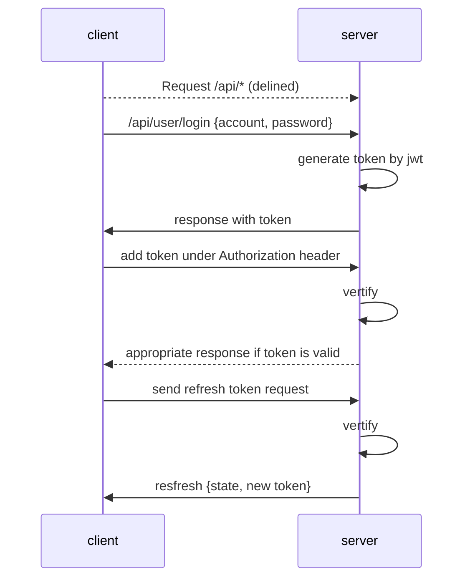
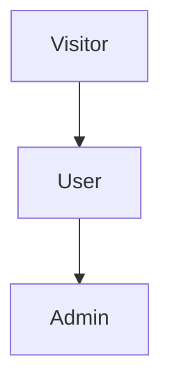
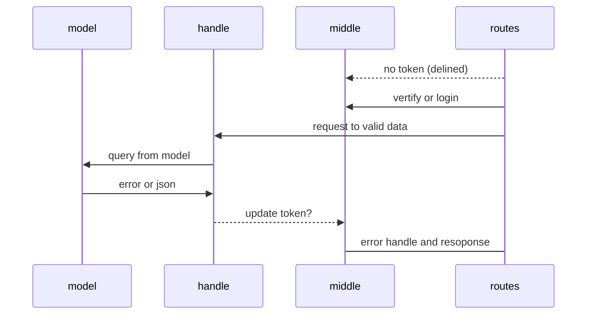
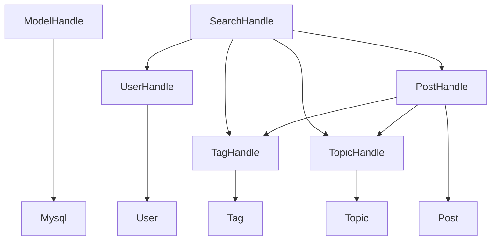
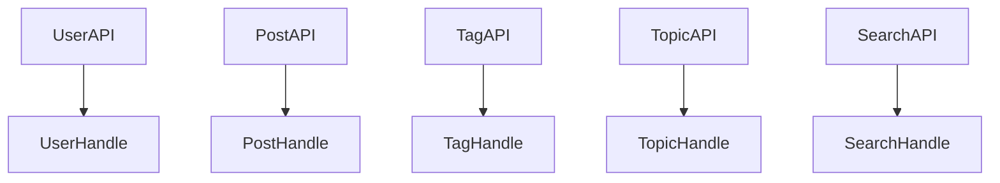

# Backend designing document and procedure

--------------------------------------

version: 0.0.1

## Base set up

--------------------------------------

**token design**
 
To avoid anonymity visit on a heavy api, such as two table select by union or join and update something. would be quite dangerous.

| Data     | Datatype |     Usage     |
|----------|:--------:|:-------------:|
| id       |  number  |    User Id    |
| auth     |  string  |  permission   |

**user permission**

|          | Admin | User | Visitor |
|:---------|:-----:|:----:|:-------:|
| /admin/* |   X   |      |         |
| /api/*   |   X   |  X   |    X    |
| /*       |   X   |  X   |    X    |    

- admin -> /api*, /admin*
- user -> /api*
- visitor -> /* exclude /admin* and /api/*

3 level design would be good enough to.

**Structure design**

